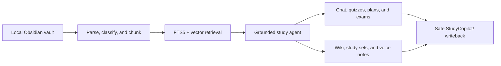

# Study Copilot

A local-first AI study assistant over an Obsidian vault. It ingests your course
materials, past papers and notes; will answer source-grounded questions, generate
revision notes and quizzes, track concept-level progress, and write outputs back
into a dedicated `StudyCopilot/` folder — **never** modifying your original notes.

The architecture and key engineering decisions are documented in
[`docs/architecture.md`](docs/architecture.md).



## Status

| Phase | Description | State |
|-------|-------------|-------|
| 0 | Setup: config, SQLite, FastAPI, logging, path-security | ✅ Done |
| 1 | Ingestion: scan → parse → classify → chunk → index | ✅ Done |
| 2 | Search: FTS5 + embeddings + hybrid retrieval | ✅ Done |
| 3 | Grounded chat (LM Studio) with citations | ✅ Done |
| 4 | Obsidian note generation | ✅ Done |
| 5 | Learning history (quizzes, confidence) | ✅ Done |
| 6 | Planning (weak topics, daily plans) | ✅ Done |
| 7 | Past papers / mock exams | ✅ Done |
| 8 | Evaluation | ✅ Done |

## Setup

```bash
python -m venv .venv
.venv/Scripts/python.exe -m pip install -r requirements.txt   # Windows
# source .venv/bin/activate && pip install -r requirements.txt # macOS/Linux
```

Copy the public-safe example, then edit `config.yaml` to point at your vault and
choose which folders are readable:

```bash
cp config.example.yaml config.yaml
```

On PowerShell, use `Copy-Item config.example.yaml config.yaml` instead.

### Local vault + iCloud sync

iCloud Drive on Windows is unreliable at syncing *newly created* notes (they get
stuck as online-only placeholders). So the copilot works against a **local**
vault and syncs to iCloud on a timer:

- `vault.root` → your local working copy
- `sync.icloud_root` → the iCloud Obsidian folder
- Point **Obsidian itself at the local `StudyVault`** going forward.

Three sync modes (`sync.mode`):

| Mode | Engine | Behaviour |
|------|--------|-----------|
| `twoway` *(default)* | `app/sync/twoway.py` | Bidirectional. Manifest-based: propagates creates/edits/deletes both ways; conflicts resolved newer-wins with a `(sync-conflict …)` backup of the loser; a deleted file that was edited on the other side is resurrected. |
| `mirror` | `robocopy /MIR` | One-way exact copy local→iCloud (deletes extras in iCloud). |
| `additive` | `robocopy /E` | One-way local→iCloud, never deletes. |

The two-way engine keeps a manifest at `data/sync_state.json` (the last synced
state) so it can tell "deleted here" from "created there". High-churn junk
(`.obsidian/workspace*.json`, `.trash/`, `.DS_Store`, `*.icloud`) is excluded.

Manual sync:

```bash
python -m scripts.sync --dry-run   # preview, change nothing
python -m scripts.sync             # sync now
```

### Run sync automatically (Windows Scheduled Task)

The sync also runs as a standalone, CWD-independent script
([`scripts/sync_standalone.py`](scripts/sync_standalone.py)) suitable for Task
Scheduler. To register a task that runs every 5 minutes for your user:

```powershell
powershell -ExecutionPolicy Bypass -File scripts\install_sync_task.ps1
```

Remove it with `scripts\uninstall_sync_task.ps1`. Each run appends to
`data/sync.log`. (`sync.run_in_app: false` in config keeps the app from also
syncing, so you don't get double runs.)

## Usage

Ingest all configured material (incremental — unchanged files are skipped):

```bash
python -m scripts.ingest
```

Run the API:

```bash
python -m app.main          # http://127.0.0.1:8000  (docs at /docs)
```

### Frontend (React + Vite)

A single-page app in [`frontend/`](frontend/) — a standalone note workspace
(Notes browser/editor + Graph view) plus the study tools (Chat, Search,
Generate, Quiz, Progress, Daily Plan, Past Papers, Library). It calls the API
through a dev proxy (`/api` → `:8000`).

```bash
cd frontend
npm install      # first time only
npm run dev      # http://localhost:5173
```

Run the backend (`python -m app.main`) and the frontend together; open
http://localhost:5173. The sidebar shows a live "Backend online" indicator.

### Desktop app (Tauri)

The same UI + backend are wrapped as a native desktop app ([`frontend/src-tauri/`](frontend/src-tauri/)).
The packaged app is **single-launch**: the Rust shell starts the Python backend
itself and opens a native window.

Toolchain (one-time): **Rust**, the **VS C++ Build Tools** (Desktop C++ workload),
and the **WebView2** runtime.

```bash
cd frontend
npm run tauri dev     # dev window (also run the backend separately)
npm run tauri build   # release: builds src-tauri/target/release/app.exe
```

- In **dev** the shell does *not* start the backend (run `python -m app.main`
  yourself); in a **release** build it spawns `pythonw -m uvicorn` on launch and
  stops it on exit (see [`src-tauri/src/lib.rs`](frontend/src-tauri/src/lib.rs)).
- The release frontend calls the backend directly via `VITE_API_BASE`
  (`frontend/.env.production`, copied from `frontend/.env.example`); the API
  client retries while the backend boots.
- The backend path is currently baked for this machine (personal build). For a
  portable installer, package the backend with PyInstaller
  ([`scripts/desktop_backend.py`](scripts/desktop_backend.py)) and ship it as a
  Tauri sidecar.

Index embeddings for vector search (needs an embedding model loaded in LM
Studio, e.g. `nomic-embed-text`; otherwise set `embeddings.provider: hash` in
config for an offline fallback):

```bash
python -m scripts.embed            # embed chunks missing an embedding
python -m scripts.embed --reindex  # re-embed everything
```

Endpoints live so far:

- `GET  /health` — config + vault sanity check
- `POST /ingest/scan` — full incremental ingest
- `POST /ingest/file` — ingest a single readable file
- `GET  /courses` — document/chunk counts per course
- `GET  /courses/{course}/documents` — list indexed documents
- `POST /search` — hybrid (keyword + vector) search with citations; filter by
  `course`/`week`/`source_type`/`max_trust_level`
- `POST /chat` — grounded Q&A; `{message, course?, conversation_id?}` → answer
  with `[S#]` citations, validated source list, and warnings
- `GET  /conversations/{id}` — replay a conversation
- `POST /notes/generate` — generate a revision note; `{course, week?, topic?,
  write?}` → preview by default, `write:true` saves into `StudyCopilot/`
- `POST /quizzes/generate` — generate a quiz (MCQ + short) from sources
- `POST /quizzes/{id}/submit` — mark answers, record events, update confidence
- `GET  /progress/{course}` — concept-level confidence, status, next review
- `POST /plans/daily` — prioritised daily study plan (optionally saved to vault)
- `POST /reports/weak-topics` — ranked weak-topic report
- `POST /past-papers/analyze` — extract past-paper questions + exam frequency
- `GET  /past-papers/{course}` — extracted questions
- `POST /exams/generate` — generate an exam-style (long-answer) mock exam
- `GET  /vault/tree` — full note tree of the vault
- `GET  /vault/note?path=` — note content, TOC headings, links, backlinks
- `PUT  /vault/note` — edit/save a text note (safe + backed up)
- `GET  /vault/graph` — note link graph (nodes + edges)
- `GET  /sync/status` — background sync state
- `POST /sync/run` — trigger a sync (`?dry_run=true` to preview)

### Planning & past papers (Phases 6-7)

- **Planning:** `/plans/daily` ranks concepts by a transparent priority (low
  confidence + high exam frequency + due-for-review), allocates focused time
  blocks within your available minutes, suggests an action per concept, and can
  save the plan to `StudyCopilot/Daily Plans/`. `/reports/weak-topics` writes a
  ranked weak-topic report.
- **Past papers:** `/past-papers/analyze` extracts questions from ingested past
  papers (heuristic, works offline), links each to a known concept, and sets
  every concept's `exam_frequency` (which then drives planning priority).
  Concept linking matches against existing concept names — take a few quizzes
  first (or run with LM Studio) so questions spread across real concepts rather
  than all landing under "General".
- **Mock exams:** `/exams/generate` reuses the quiz pipeline in an exam style
  (longer short-answer questions); submit them via `/quizzes/{id}/submit` for
  rubric-based feedback.

### Learning history (Phase 5)

Quizzes are generated from retrieved sources (MCQ + short answer) with answer
keys kept **server-side**. On submit, MCQs are marked deterministically and
short answers by the model (with an offline heuristic fallback). Each result
becomes a `LearningEvent`, and per-concept **confidence** is recomputed with a
transparent formula (recent + long-term accuracy + review recency + difficulty —
plan §17), driving a status band (weak/developing/good/strong) and a
spaced-repetition `next_review` date (plan §18). `GET /progress/{course}` exposes
it; the frontend Progress page visualises it.

### Note generation (Phase 4)

`POST /notes/generate` retrieves a week/topic's sources, asks the model for a
structured note body with `[S#]` citations, then wraps it in **AI-generated
frontmatter** (`source_type: ai-generated`, `reviewed_by_user: false`,
`derived_from` backlinks), a review-warning banner, and a Sources section.

- **Preview-first:** returns the markdown without writing unless `write:true`.
- **Writes are confined to `StudyCopilot/Generated Notes/`** — the same
  path-security layer that protects your source notes; attempts elsewhere 403.
- Saved notes sync to iCloud automatically via the two-way sync.

### Standalone note workspace (Phase 9)

The app doubles as an Obsidian-style workspace over the **whole vault**:

- **Notes** — a folder tree, rendered Markdown with clickable `[[wikilinks]]`,
  a table-of-contents outline, and "linked mentions" (backlinks).
- **Editing** — edit and save any text note in place. Edits are still refused
  for denied paths (`.obsidian`/`.git`/`.env`/`.trash`) and outside the vault,
  and the previous version is backed up to `StudyCopilot/_backups/` first, so
  every change is reversible.
- **Graph** — an interactive force-directed graph of notes linked by wikilinks;
  click a node to open it.

UI: a top bar toggles the left sidebar, the note **outline (TOC)**, and a
slide-in **Chat panel** on the right. The file tree has an Obsidian-style
toolbar — **new note**, **new folder**, **sort**, **reveal current note**, and
**expand/collapse all**.

**Tabs:** open multiple notes as tabs (`+` opens an empty tab with a note
picker; Ctrl/⌘-click a note for a new tab; middle-click or ✕ to close). The tab
bar has a **book ↔ pen** reading/edit toggle and a **⋮ menu** with file actions
— rename, move, copy path, reveal in file explorer, open in default app, export
to PDF, and delete (reversible — moved to `StudyCopilot/_backups/_deleted/`).

Backed by `app/vault/` (filesystem-direct, independent of the RAG index) and the
`/vault/*` endpoints.

### Grounded chat (Phase 3)

`POST /chat` retrieves with hybrid search, builds a numbered source context,
and asks the local model (LM Studio) to answer **only** from those sources with
`[S#]` citations. The answer's citations are then **validated** against the
sources actually provided — hallucinated markers and uncited claims are flagged
in `warnings`. If the model is unavailable, the endpoint still returns the
retrieved sources with a note. Conversations persist (`conversations`/`messages`
tables) so follow-up questions keep context.

> Needs a chat model loaded in LM Studio. The model never sees anything beyond
> the retrieved chunks, so answers stay grounded in your own materials.

### Retrieval design (Phase 2)

- **Keyword:** SQLite FTS5 (BM25), kept in sync with `chunks` via triggers.
- **Vector:** embeddings stored as float32 blobs; brute-force cosine in numpy
  (swap for Chroma/Qdrant later behind the same interface).
- **Hybrid:** Reciprocal Rank Fusion of keyword + vector, then a trust-level
  bonus so official material outranks unreviewed notes on ties.
- **Graceful:** if the embedding endpoint is down, search returns keyword-only
  results with a note instead of failing.

## Tests

```bash
python -m pytest
```

## Evaluation

A regression harness ([`evals/`](evals/)) measures retrieval quality, the safety
guarantees, and marking consistency, and writes a local `evals/report.md`:

```bash
python -m scripts.evaluate          # writes evals/report.md
```

- **Retrieval** — keyword-presence recall@k + MRR over a seed dataset
  ([`evals/retrieval_dataset.json`](evals/retrieval_dataset.json)).
- **Safety** — programmatic checks that writes stay inside `StudyCopilot/`,
  path traversal is blocked, and `.env`/`.obsidian` are unreadable.
- **Marking** — same input grades identically (determinism guard).

Run it against your own vault to establish a project-specific baseline and
compare keyword-only retrieval with semantic vector search. Generated reports
are ignored so document titles and local evaluation data are not published.

## Safety model

- **Reads** are confined to the vault's `read_paths` + configured
  `external_sources`, and `denied_paths` (`.env`, `.git`, `.obsidian`, `.ssh`)
  are always blocked — even against path-traversal attempts.
- **Writes** are confined to `StudyCopilot/` and nothing else.
- Source files are never rewritten; classification is inferred, never persisted
  back to your notes.

All path enforcement lives in [`app/security/paths.py`](app/security/paths.py)
and is covered by [`tests/test_paths.py`](tests/test_paths.py).

## Layout

```
app/
  config/       settings loaded from config.yaml
  security/     path permission enforcement (read/write/denied)
  database/     SQLAlchemy models (Document, Chunk) + session
  ingestion/    scanner, markdown/pdf parsers, classifier, chunker, service
  models/       embedding + chat adapters (LM Studio / offline fallbacks)
  retrieval/    keyword (FTS5), vector, hybrid fusion, citations, service
  agent/        context builder, prompts, citation validation, study agent
  generation/   revision notes, quizzes + marking, plans/reports
  learning/     concepts, confidence, spaced repetition, planner, events
  exams/        past-paper extraction + exam-frequency estimation
  vault/        standalone note workspace: tree, read, edit, link graph
  obsidian/     templates, links, path-safe note writer
  sync/         local-vault -> iCloud mirror (robocopy) + background scheduler
  api/          routers (health, ingest, courses, search, chat, notes,
                quizzes, plans, exams, vault, sync)
scripts/        CLI entrypoints (ingest, embed, sync, evaluate)
evals/          evaluation harness + seed dataset + report
tests/          pytest suite
```
