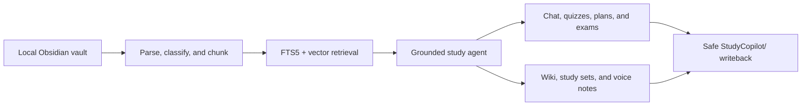
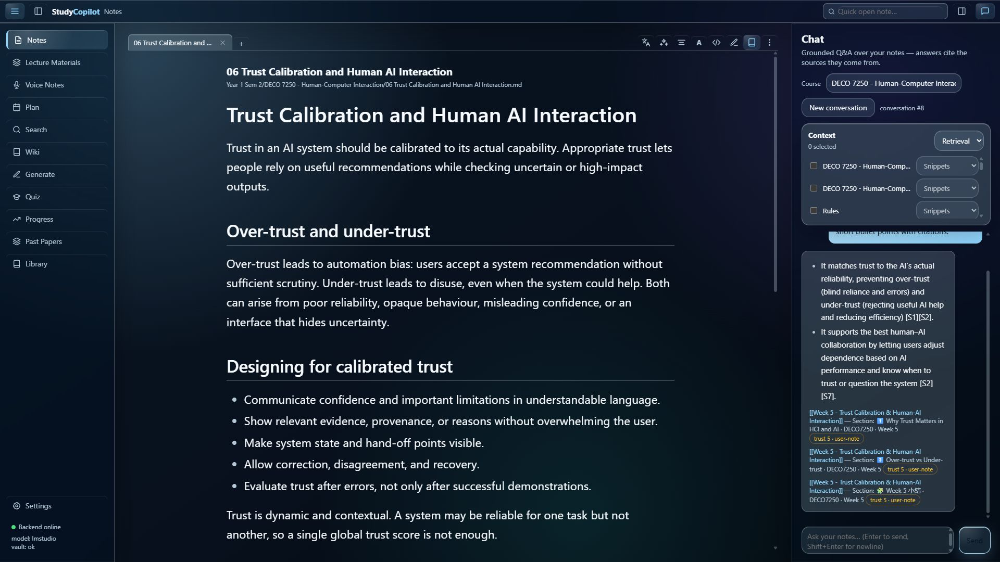
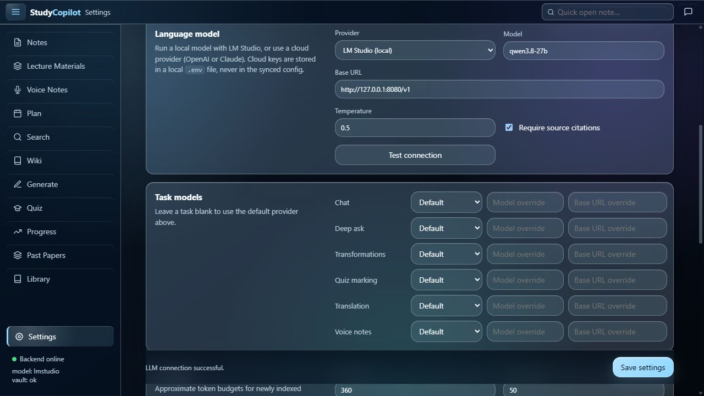

# Study Copilot

**A private, local-first AI study workspace for an Obsidian vault.** Study
Copilot turns course notes, lecture slides and past papers into source-grounded
answers, revision notes, quizzes, study plans and mock exams. The default AI
path runs through a local OpenAI-compatible LLM, so study material does not need
to leave the machine.

Unlike a general-purpose chatbot, Study Copilot keeps the full learning loop in
one place: retrieve the right evidence, show where every answer came from,
practise the concept, record confidence, and use that history to decide what to
study next. Generated files are confined to a dedicated `StudyCopilot/` folder;
original notes are never overwritten.

## Download

| Your computer | Download |
| --- | --- |
| **Windows** 10 / 11 (64-bit) | [**Study-Copilot-Windows-setup.exe**](https://github.com/Ivan53040/Study-Copilot/releases/latest/download/Study-Copilot-Windows-setup.exe) |
| **Mac** with Apple silicon (M1, M2, M3, M4) | [**Study-Copilot-macOS-AppleSilicon.dmg**](https://github.com/Ivan53040/Study-Copilot/releases/latest/download/Study-Copilot-macOS-AppleSilicon.dmg) |
| **Mac** with an Intel chip | [**Study-Copilot-macOS-Intel.dmg**](https://github.com/Ivan53040/Study-Copilot/releases/latest/download/Study-Copilot-macOS-Intel.dmg) |

All versions are on the [Releases page](https://github.com/Ivan53040/Study-Copilot/releases),
each with a SHA-256 checksum. No Python or Node needed.
Not sure which Mac you have? Apple menu -> **About This Mac**: "Chip: Apple M..." means
Apple silicon, "Processor: Intel" means Intel.

**Windows.** Run the installer (no admin rights needed). The app is not code-signed, so
Windows SmartScreen may show "Windows protected your PC": choose **More info -> Run
anyway**.

**Mac.** Open the `.dmg` and drag **Study Copilot** into **Applications**. The app is not
signed with an Apple Developer ID, so macOS blocks the first launch ("Apple could not verify
...").

- macOS 14 and earlier: right-click (Control-click) the app -> **Open** -> **Open**.
- macOS 15 and later: try to open it once, then go to **System Settings -> Privacy &
  Security**, scroll down and click **Open Anyway**.
- Or, in Terminal: `xattr -dr com.apple.quarantine "/Applications/Study Copilot.app"`

You only need to do this once. The Mac build is newer than the Windows one and has had less
testing, so please [open an issue](https://github.com/Ivan53040/Study-Copilot/issues) if
something is off.

**First start (both).** The app creates a starter vault (`Documents/Study Copilot Vault`)
and keeps its settings and database in `%APPDATA%\Study Copilot` (Windows) or
`~/Library/Application Support/Study Copilot` (Mac). To use an existing Obsidian vault, change
**Settings -> Vault folder**.

- **Chat needs a language model.** Install [LM Studio](https://lmstudio.ai), load a model and
  start its local server (the default), or connect your Claude / ChatGPT subscription or an API
  key in **Settings**. Nothing is sent anywhere unless you choose a cloud model.
- Semantic search starts in an offline mode (`embeddings.provider: hash`). For better results
  load an embedding model such as `nomic-embed-text` in LM Studio and switch Settings ->
  Embeddings to LM Studio.
- Not available on Mac yet: the built-in PowerPoint slide preview (it uses Microsoft PowerPoint
  on Windows; use **Open** instead) and the iCloud sync helper (it relies on Windows' `robocopy`;
  on a Mac the iCloud Drive folder syncs by itself, so just point Settings at it).
- Uninstall: Windows **Settings -> Apps**; Mac drag the app to the Bin. Your notes and the settings
  folder above are left in place.

## What makes it different

- **Local LLM by default** — works with LM Studio and other OpenAI-compatible
  local endpoints; cloud providers remain optional.
- **Grounded, inspectable answers** — hybrid SQLite FTS5 + vector retrieval,
  inline `[S#]` citations, source trust metadata, and post-generation citation
  validation.
- **More than chat** — quizzes, marking, concept confidence, spaced repetition,
  daily plans, weak-topic reports, revision notes and past-paper-style exams all
  share the same course context.
- **Obsidian-native and privacy-aware** — reads the configured vault, preserves
  wikilinks and backlinks, blocks denied paths, and limits generated write-back
  to the safe output area.

### Visual page retrieval (optional)

PDF pages and PowerPoint slides can be indexed as visual evidence. In Settings,
save a vision-capable model for **Visual page indexing**, then click **Index next
20 pages**. This runs in the background and embeds the new descriptions. The
equivalent command-line workflow is: set `task_models.visual_pages` to a local
vision model in `config.yaml`, ingest the source files, then run:

```bash
python -m scripts.index_visual_pages --limit 20
python -m scripts.embed
```

The first command adds one searchable visual description per page; later runs
skip pages already indexed. `--document-id ID` limits a run to one document.
Set `generation.include_page_images: true` after selecting a vision-capable
`task_models.chat` model. Chat then sends up to two retrieved original page
images alongside text evidence. If the model rejects images, chat retries with
text and warns that visual evidence was unavailable. Page citations open the
original page in the app.

For a page-level retrieval benchmark, copy
`evals/page_dataset.example.json`, label the relevant pages in your vault,
and run `python -m scripts.evaluate_pages your_dataset.json --k 5`.
The report includes Recall@K, MRR, MAP, and nDCG; it needs real page labels.
For answer quality, label individual claims using
`evals/grounding_dataset.example.json` and run
`python -m scripts.evaluate_grounding your_claims.json`. This measures whether
claims are supported by the source material and whether each cited page
supports the claim; citation-marker validity alone does not establish either.

The architecture and key engineering decisions are documented in
[`docs/architecture.md`](docs/architecture.md).


```mermaid
flowchart LR
    A["Local Obsidian vault"] --> B["Parse, classify, and chunk"]
    B --> C["FTS5 + vector retrieval"]
    C --> D["Grounded study agent"]
    D --> E["Chat, quizzes, plans, and exams"]
    D --> F["Wiki, study sets, and voice notes"]
    E --> G["Safe StudyCopilot/ writeback"]
    F --> G
```



_The grounded chat workflow lets a student select source material, combine manual context with retrieval, ask a question, and inspect the cited note and trust metadata beside the answer._



_Local model configuration is visible and testable inside the app. Each AI task
can inherit the local default or use its own model override._

## Status

| Phase | Description | State |
|-------|-------------|-------|
| 0 | Setup: config, SQLite, FastAPI, logging, path-security | ✅ Done |
| 1 | Ingestion: scan → parse → classify → chunk → index | ✅ Done |
| 2 | Search: FTS5 + embeddings + hybrid retrieval | ✅ Done |
| 3 | Grounded chat (LM Studio) with citations | ✅ Done |
| 4 | Obsidian note generation | ✅ Done |
| 5 | Learning history (quizzes, confidence) | ✅ Done |
| 6 | Planning (weak topics, daily plans) | ✅ Done |
| 7 | Past papers / mock exams | ✅ Done |
| 8 | Evaluation | ✅ Done |

## Setup

```bash
python -m venv .venv
.venv/Scripts/python.exe -m pip install -r requirements.txt   # Windows
# source .venv/bin/activate && pip install -r requirements.txt # macOS/Linux
```

Copy the public-safe example, then edit `config.yaml` to point at your vault and
choose which folders are readable:

```bash
cp config.example.yaml config.yaml
```

On PowerShell, use `Copy-Item config.example.yaml config.yaml` instead.

### Chat models: local, your Claude / ChatGPT subscription, or an API key

Pick the model for each chat from the menu next to the send button; Settings →
Language model sets the default (and per-task overrides).

- **Local** — LM Studio / llama.cpp (`models.lmstudio`).
- **Your Claude Pro/Max or ChatGPT Plus/Pro plan** — Anthropic and OpenAI don't
  let other apps sign in to those accounts, so Study Copilot runs their own
  command-line tools on this computer, which you sign in to once:

  | | Install (PowerShell / terminal) | Sign in once |
  | --- | --- | --- |
  | Claude (Claude Code) | `irm https://claude.ai/install.ps1 \| iex` or `npm install -g @anthropic-ai/claude-code` | run `claude`, sign in with your Claude account |
  | ChatGPT (Codex) | `npm install -g @openai/codex` | run `codex`, choose *Sign in with ChatGPT* |

  Settings shows whether each is installed and signed in (**Check again**
  after setting one up). The app never sees your account or its tokens; each
  reply is one run of the tool (`claude -p` with every tool turned off, or
  `codex exec` read-only in an empty scratch folder), and usage counts toward
  your plan's limits. Replies take a few seconds longer to start than the API.
  ChatGPT answers arrive in one piece rather than word by word, and page images
  aren't sent (answers use the text). API keys in the environment are hidden
  from these tools so they bill the plan, not an API account. This is for your
  own use: if you share the app, each person signs in with their own account.
  Config: `models.claude_code` (`model`: sonnet / opus / haiku, `command`,
  `effort`) and `models.codex` (`model`, blank = Codex's default).
- **API keys** — `openai` (or any OpenAI-compatible gateway) and `anthropic`;
  keys go in the git-ignored `.env`, pay-as-you-go.

### Local vault + iCloud sync

iCloud Drive on Windows is unreliable at syncing *newly created* notes (they get
stuck as online-only placeholders). So the copilot works against a **local**
vault and syncs to iCloud on a timer:

- `vault.root` → your local working copy
- `sync.icloud_root` → the iCloud Obsidian folder
- Point **Obsidian itself at the local `StudyVault`** going forward.

Three sync modes (`sync.mode`):

| Mode | Engine | Behaviour |
|------|--------|-----------|
| `twoway` *(default)* | `app/sync/twoway.py` | Bidirectional. Manifest-based: propagates creates/edits/deletes both ways; conflicts resolved newer-wins with a `(sync-conflict …)` backup of the loser; a deleted file that was edited on the other side is resurrected. |
| `mirror` | `robocopy /MIR` | One-way exact copy local→iCloud (deletes extras in iCloud). |
| `additive` | `robocopy /E` | One-way local→iCloud, never deletes. |

The two-way engine keeps a manifest at `data/sync_state.json` (the last synced
state) so it can tell "deleted here" from "created there". High-churn junk
(`.obsidian/workspace*.json`, `.trash/`, `.DS_Store`, `*.icloud`) is excluded.

Manual sync:

```bash
python -m scripts.sync --dry-run   # preview, change nothing
python -m scripts.sync             # sync now
```

When `sync.enabled` is true, Study Copilot runs one sync before opening the
workspace. The packaged desktop app also runs one sync after it closes. Set
`sync.run_in_app: false` to use only these open/close syncs; set it to true to
add interval syncs while the app remains open.

### Run sync automatically (Windows Scheduled Task)

The sync also runs as a standalone, CWD-independent script
([`scripts/sync_standalone.py`](scripts/sync_standalone.py)) suitable for Task
Scheduler. To register a task that runs every 5 minutes for your user:

```powershell
powershell -ExecutionPolicy Bypass -File scripts\install_sync_task.ps1
```

Remove it with `scripts\uninstall_sync_task.ps1`. Each run appends to
`data/sync.log`. (`sync.run_in_app: false` in config keeps the app from also
syncing, so you don't get double runs.)

## Usage

Ingest all configured material (incremental — unchanged files are skipped):

```bash
python -m scripts.ingest
```

Run the API:

```bash
python -m app.main          # http://127.0.0.1:8000  (docs at /docs)
```

### Frontend (React + Vite)

A single-page app in [`frontend/`](frontend/) — a standalone note workspace
(Notes browser/editor + Graph view) plus the study tools (Chat, Search,
Generate, Quiz, Progress, Daily Plan, Past Papers, Library). It calls the API
through a dev proxy (`/api` → `:8765`, or the URL in `STUDY_COPILOT_API`).

```bash
cd frontend
npm install      # first time only
npm run dev      # http://localhost:5173
```

Run the backend (`python -m app.main`) and the frontend together; open
http://localhost:5173. The settings button at the bottom of the sidebar shows
a live backend status dot and the active chat model.

**Layout.** The interface follows a calm, chat-first layout:

- **Home is a new chat**: a greeting, one centred composer, and quick actions
  (explain a concept, quiz me, revision note, plan my day). The composer's
  **book** chip scopes answers to a course, folder or study set; the **+**
  button picks the context mode (*Auto* retrieval, *Selected* sources only, or
  *Both*) and individual documents as snippets or full text.
- **Answers stream in** as the model writes them. Reasoning models show a
  collapsible *Thinking…* line; the send button turns into **Stop** (what was
  written so far is kept; stopping before the answer starts puts your
  question back in the box). Hover your question to **edit** it, or use
  **Regenerate** under the last answer; both replace the replies after that
  message. **Quiz me on this** makes a short quiz from the answer's sources.
- **Answers** render in a reading serif with numbered citation chips; hover a
  chip to highlight its source card, click to open the note (or the exact PDF
  / slide page).
- **Today** (sidebar): countdowns to your exam and assignment dates, topics
  due for spaced-repetition review, weak topics (Quiz me / Ask), and a plan
  for the time you have that builds up to the next exam. The home screen shows
  a one-line nudge when something is close.
- **Sidebar**: New chat (Ctrl/⌘+Shift+O), Search (Ctrl/⌘+K opens a palette
  over notes, chats and pages), the note workspace, collapsible *Study tools*,
  and **Recents**, your saved conversations with rename and delete. Collapse it
  to an icon rail; under 900 px it becomes a drawer.
- On every other page a **chat side panel** (speech-bubble button, top right)
  keeps the conversation next to your notes; *Open in full view* moves it to
  the main chat. Next to an open note it answers from **that note** and the
  notes it links to (or that link back); click the note chip to search all
  notes instead.
- Pages other than chat load on first use, and heavy parts (Mermaid, KaTeX,
  code highlighting, the note editors, the graph) load in the background or
  when needed, so start-up only fetches about a fifth of the old bundle.
- **Appearance** (Settings): Light, Dark or Match system, a serif or sans
  reading font, text size, and the name used in the greeting. The serif is
  Source Serif 4 (SIL Open Font License, bundled in `frontend/src/fonts/`).

### One-click launcher (Windows)

Double-click **`Study Copilot.cmd`** in the project folder. The first run also
puts a **Study Copilot** shortcut (with the app icon) on your desktop; use that
from then on.

- It starts the backend on `127.0.0.1:8767`, which in this mode also serves the
  built interface (`frontend/dist-web`), so no dev server or console windows
  are needed.
- It opens the app in its own window (Microsoft Edge or Chrome app mode, with a
  separate profile in `data/app-window`).
- Closing that window stops the backend and runs one vault sync, like the
  packaged desktop app.
- When the frontend source is newer than the last build it rebuilds the
  interface first (`npm run build:web`, needs Node.js).
- Logs: `data/launcher.log`, `data/launcher-backend.log`,
  `data/launcher-build.log`.

The sync scripts treat any Study Copilot backend on ports 8765 (older desktop
builds), 8766 (`scripts\restart_dev.cmd`), 8767 (launcher) or 8768 (desktop
app, or the port it recorded in `data/desktop-port.txt`) as "app open" and
wait. They check that the port really answers as Study Copilot, so another
program on one of those ports no longer blocks syncing.

### Desktop app (Tauri, Windows and macOS)

The same UI + backend are wrapped as a native desktop app ([`frontend/src-tauri/`](frontend/src-tauri/)).
The packaged app is **single-launch**: the Rust shell starts the Python backend
itself and opens a native window. Opening it again while it runs brings the
existing window to the front instead of starting a second backend.

Toolchain (one-time): **Rust**, the **VS C++ Build Tools** (Desktop C++ workload),
and the **WebView2** runtime.

To build the installer, double-click **`scripts\build_desktop.cmd`** (it runs
`npm run tauri build` and opens the folder with the new
`Study Copilot_<version>_x64-setup.exe`). Or by hand:

```bash
cd frontend
npm run tauri dev     # dev window (also run the backend separately)
npm run tauri build   # release: builds src-tauri/target/release/app.exe
```

- In **dev** the shell does *not* start the backend (run `python -m app.main`
  yourself); in a **release** build it spawns `pythonw -m uvicorn` on launch and
  stops it on exit (see [`src-tauri/src/lib.rs`](frontend/src-tauri/src/lib.rs)).
- The backend port is chosen at launch: `STUDY_COPILOT_PORT` if set, else
  **8768**, else any free port. The page asks the shell for it
  (`backend_url` command) before it renders, so the app never talks to some
  other program that happens to hold a port (8765 is often a local model
  server). `VITE_API_BASE` in `frontend/.env.production` is only a fallback.
  The API client retries while the backend boots.
- **Portable installer.** The backend is frozen with PyInstaller
  ([`scripts/build_backend.py`](scripts/build_backend.py), entry point
  [`scripts/desktop_backend.py`](scripts/desktop_backend.py)) into
  `build/backend/study-copilot-backend/`, which Tauri ships inside the installer
  (`bundle.resources`). On start the shell runs that exe with no console window;
  it keeps config and data in `%APPDATA%\Study Copilot`. A checkout that still has
  a `.venv` next to it keeps the old behaviour (runs the project's Python and
  `config.yaml`); set `STUDY_COPILOT_MODE=bundled` to test the bundled backend from
  a checkout.
- **Releases.** Pushing a tag like `v0.3.2` runs
  [`.github/workflows/release.yml`](.github/workflows/release.yml): on clean Windows and macOS
  runners it freezes the backend, smoke-tests it, builds the app and attaches
  `Study-Copilot-Windows-setup.exe`, `Study-Copilot-macOS-AppleSilicon.dmg` and
  `Study-Copilot-macOS-Intel.dmg` (plus checksums) to the release. The file names carry no
  version, so the links in [Download](#download) always point to the newest release.
- **macOS build.** The `.app` is built by Tauri (`src-tauri/tauri.macos.conf.json`), the frozen
  backend is copied into `Contents/Resources/backend`, the bundle is signed ad hoc (no Apple
  Developer ID) and wrapped in a `.dmg`. To build it yourself on a Mac:
  `python scripts/build_backend.py`, then `cd frontend && npm ci && npm run tauri build`, then copy
  `build/backend/study-copilot-backend` into the `.app`'s `Contents/Resources/backend`.
- To build the Windows installer yourself, run `scripts\build_desktop.cmd` (needs Node.js, Rust
  and Python).

Index embeddings for vector search (needs an embedding model loaded in LM
Studio, e.g. `nomic-embed-text`; otherwise set `embeddings.provider: hash` in
config for an offline fallback):

```bash
python -m scripts.embed            # embed chunks missing an embedding
python -m scripts.embed --reindex  # re-embed everything
```

Endpoints live so far:

- `GET  /health` — config + vault sanity check
- `POST /ingest/scan` — full incremental ingest
- `POST /ingest/file` — ingest a single readable file
- `GET  /courses` — document/chunk counts per course
- `GET  /courses/{course}/documents` — list indexed documents
- `POST /search` — hybrid (keyword + vector) search with citations; filter by
  `course`/`week`/`source_type`/`max_trust_level`
- `POST /chat` — grounded Q&A; `{message, course?, conversation_id?}` → answer
  with `[S#]` citations, validated source list, and warnings. Optional
  `note_path` answers from one note and its linked notes; `replace_from_id`
  replaces a saved question and everything after it (edit / regenerate)
- `POST /chat/stream` — same request, streamed as NDJSON events: `start`
  (conversation, saved question id, sources) → `thinking` / `delta` → `done`
  (same shape as `POST /chat`) or `error`. `rethink` means the text sent so
  far was reasoning (models whose template opens `<think>` in the prompt only
  send `</think>`). Closing the connection saves the partial answer at once,
  even while the model is still reading the prompt, and stops the model; if
  `start` never reached the reader, a new question is undone instead
- `GET  /today` — the Today page in one call (deadlines, reviews due, weak
  topics, plan, weekly stats); `?course=&minutes=`
- `GET|POST /deadlines`, `DELETE /deadlines/{id}` — exam / assignment dates
- `GET  /conversations` — recent conversations (title, course, last activity)
  for the sidebar; `?limit=` (1–200, default 50)
- `GET  /conversations/{id}` — replay a conversation (messages carry `id`s)
- `PATCH /conversations/{id}` — rename (`{title}`; blank reverts to the
  automatic title from the first question)
- `DELETE /conversations/{id}` — delete a conversation and its messages
- `POST /notes/generate` — generate a revision note; `{course, week?, topic?,
  write?}` → preview by default, `write:true` saves into `StudyCopilot/`
- `POST /quizzes/generate` — generate a quiz (MCQ + short) from sources
- `POST /quizzes/{id}/submit` — mark answers, record events, update confidence
- `GET  /progress/{course}` — concept-level confidence, status, next review
- `POST /plans/daily` — prioritised daily study plan (optionally saved to vault)
- `POST /reports/weak-topics` — ranked weak-topic report
- `POST /past-papers/analyze` — extract past-paper questions + exam frequency
- `GET  /past-papers/{course}` — extracted questions
- `POST /exams/generate` — generate an exam-style (long-answer) mock exam
- `GET  /vault/tree` — full note tree of the vault
- `GET  /vault/note?path=` — note content, TOC headings, links, backlinks
- `PUT  /vault/note` — edit/save a text note (safe + backed up)
- `GET  /vault/graph` — note link graph (nodes + edges)
- `GET  /sync/status` — background sync state
- `POST /sync/run` — trigger a sync (`?dry_run=true` to preview)

### Planning & past papers (Phases 6-7)

- **Planning:** `/plans/daily` ranks concepts by a transparent priority (low
  confidence + high exam frequency + due-for-review), allocates focused time
  blocks within your available minutes, suggests an action per concept, and can
  save the plan to `StudyCopilot/Daily Plans/`. `/reports/weak-topics` writes a
  ranked weak-topic report.
- **Past papers:** `/past-papers/analyze` extracts questions from ingested past
  papers (heuristic, works offline), links each to a known concept, and sets
  every concept's `exam_frequency` (which then drives planning priority).
  Concept linking matches against existing concept names — take a few quizzes
  first (or run with LM Studio) so questions spread across real concepts rather
  than all landing under "General".
- **Mock exams:** `/exams/generate` reuses the quiz pipeline in an exam style
  (longer short-answer questions); submit them via `/quizzes/{id}/submit` for
  rubric-based feedback.

### Learning history (Phase 5)

Quizzes are generated from retrieved sources (MCQ + short answer) with answer
keys kept **server-side**. On submit, MCQs are marked deterministically and
short answers by the model (with an offline heuristic fallback). Each result
becomes a `LearningEvent`, and per-concept **confidence** is recomputed with a
transparent formula (recent + long-term accuracy + review recency + difficulty —
plan §17), driving a status band (weak/developing/good/strong) and a
spaced-repetition `next_review` date (plan §18). `GET /progress/{course}` exposes
it; the frontend Progress page visualises it.

### Note generation (Phase 4)

`POST /notes/generate` retrieves a week/topic's sources, asks the model for a
structured note body with `[S#]` citations, then wraps it in **AI-generated
frontmatter** (`source_type: ai-generated`, `reviewed_by_user: false`,
`derived_from` backlinks), a review-warning banner, and a Sources section.

- **Preview-first:** returns the markdown without writing unless `write:true`.
- **Writes are confined to `StudyCopilot/Generated Notes/`** — the same
  path-security layer that protects your source notes; attempts elsewhere 403.
- Saved notes sync to iCloud automatically via the two-way sync.

### Standalone note workspace (Phase 9)

The app doubles as an Obsidian-style workspace over the **whole vault**:

- **Notes** — a folder tree, rendered Markdown with clickable `[[wikilinks]]`,
  a table-of-contents outline, and "linked mentions" (backlinks).
- **Editing** — edit and save any text note in place. Edits are still refused
  for denied paths (`.obsidian`/`.git`/`.env`/`.trash`) and outside the vault,
  and the previous version is backed up to `StudyCopilot/_backups/` first, so
  every change is reversible.
- **Graph** — an interactive force-directed graph of notes linked by wikilinks;
  click a node to open it.

UI: the page header toggles the **file tree**, the note **outline (TOC)**, and a
slide-in **Chat panel** on the right. The file tree has an Obsidian-style
toolbar — **new note**, **new folder**, **sort**, **reveal current note**, and
**expand/collapse all**.

**Tabs:** open multiple notes as tabs (`+` opens an empty tab with a note
picker; Ctrl/⌘-click a note for a new tab; middle-click or ✕ to close). The tab
bar has a **book ↔ pen** reading/edit toggle and a **⋮ menu** with file actions
— rename, move, copy path, reveal in file explorer, open in default app, export
to PDF, and delete (reversible — moved to `StudyCopilot/_backups/_deleted/`).

Backed by `app/vault/` (filesystem-direct, independent of the RAG index) and the
`/vault/*` endpoints.

**Speed.** The running app keeps an in-memory index of the vault
([`app/vault/index.py`](app/vault/index.py)): one scan at startup, then a file
watcher (`watchfiles`, already installed with `uvicorn[standard]`) applies
changes as they happen, with a safety rescan every two minutes. Tree, note,
search and scope requests are served from memory instead of walking the disk,
and the app's own writes update the index immediately. Opening a note loads
its text first (`/vault/note?links=false`) and its links and backlinks in
parallel (`/vault/note-links`), and the notes workspace stays mounted when you
switch pages.

### Grounded chat (Phase 3)

`POST /chat` retrieves with hybrid search, builds a numbered source context,
and asks the local model (LM Studio) to answer **only** from those sources with
`[S#]` citations. The answer's citations are then **validated** against the
sources actually provided — hallucinated markers and uncited claims are flagged
in `warnings`. If the model is unavailable, the endpoint still returns the
retrieved sources with a note. Conversations persist (`conversations`/`messages`
tables) so follow-up questions keep context.

> Needs a chat model loaded in LM Studio. The model never sees anything beyond
> the retrieved chunks, so answers stay grounded in your own materials.

### Retrieval design (Phase 2)

- **Keyword:** SQLite FTS5 (BM25), kept in sync with `chunks` via triggers.
- **Vector:** embeddings stored as float32 blobs; brute-force cosine in numpy
  (swap for Chroma/Qdrant later behind the same interface).
- **Hybrid:** Reciprocal Rank Fusion of keyword + vector, then a trust-level
  bonus so official material outranks unreviewed notes on ties.
- **Graceful:** if the embedding endpoint is down, search returns keyword-only
  results with a note instead of failing.

## Tests

```bash
python -m pytest                 # backend (about 240 tests)

cd frontend
npm run typecheck                # TypeScript
npm run build:web                # build the UI the browser tests use
npx playwright install chromium  # once
npm run test:e2e                 # browser smoke tests (frontend/e2e)
```

The browser tests start their own server (`scripts/e2e_server.py`) on port
8799 with a copy of the fixture vault in `frontend/e2e/fixtures/vault`, an
empty database and a scripted chat model, so they never touch your real vault
or need LM Studio. The server runs with the project's `.venv` Python when there
is one (set `E2E_PYTHON` to use another). They cover streaming chat (stop, edit, regenerate), the
note-scoped chat panel, Notes, Today, "Quiz me on this", appearance and quick
open.

GitHub Actions (`.github/workflows/ci.yml`) runs the same checks on every push
to `main`, `claude/**` and `codex/**` branches and on pull requests: backend
tests, type-check + build, the browser tests, and a compile check of the
desktop shell.

## Evaluation

A regression harness ([`evals/`](evals/)) measures retrieval quality, the safety
guarantees, and marking consistency, and writes a local `evals/report.md`:

```bash
python -m scripts.evaluate          # writes evals/report.md
```

- **Retrieval** — keyword-presence recall@k + MRR over a seed dataset
  ([`evals/retrieval_dataset.json`](evals/retrieval_dataset.json)).
- **Safety** — programmatic checks that writes stay inside `StudyCopilot/`,
  path traversal is blocked, and `.env`/`.obsidian` are unreadable.
- **Marking** — same input grades identically (determinism guard).

Run it against your own vault to establish a project-specific baseline and
compare keyword-only retrieval with semantic vector search. Generated reports
are ignored so document titles and local evaluation data are not published.

## Safety model

- **Reads** are confined to the vault's `read_paths` + configured
  `external_sources`, and `denied_paths` (`.env`, `.git`, `.obsidian`, `.ssh`)
  are always blocked — even against path-traversal attempts.
- **Writes** are confined to `StudyCopilot/` and nothing else.
- Source files are never rewritten; classification is inferred, never persisted
  back to your notes.

All path enforcement lives in [`app/security/paths.py`](app/security/paths.py)
and is covered by [`tests/test_paths.py`](tests/test_paths.py).

## Layout

```
app/
  config/       settings loaded from config.yaml
  security/     path permission enforcement (read/write/denied)
  database/     SQLAlchemy models (Document, Chunk) + session
  ingestion/    scanner, markdown/pdf parsers, classifier, chunker, service
  models/       embedding + chat adapters (LM Studio / offline fallbacks)
  retrieval/    keyword (FTS5), vector, hybrid fusion, citations, service
  agent/        context builder, prompts, citation validation, study agent
  generation/   revision notes, quizzes + marking, plans/reports
  learning/     concepts, confidence, spaced repetition, planner, events
  exams/        past-paper extraction + exam-frequency estimation
  vault/        standalone note workspace: tree, read, edit, link graph
  obsidian/     templates, links, path-safe note writer
  sync/         local-vault -> iCloud mirror (robocopy) + background scheduler
  api/          routers (health, ingest, courses, search, chat, notes,
                quizzes, plans, exams, vault, sync)
scripts/        CLI entrypoints (ingest, embed, sync, evaluate), launcher,
                e2e_server.py for the browser tests
evals/          evaluation harness + seed dataset + report
tests/          pytest suite
frontend/e2e/   Playwright browser tests + fixture vault
```
